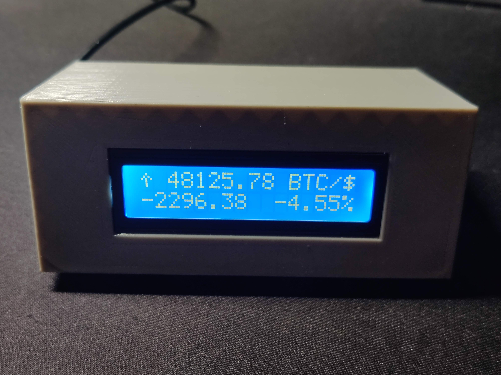

# ESP8266 Bitcoin Tracker

A Bitcoin price tracker for the ESP8266 WiFi module, designed to display real-time cryptocurrency prices on an OLED or LCD displays.




## Features
- Real-time Bitcoin price tracking
- OLED display for clear visualization
- Customizable symbols and price display
- WiFi connectivity for fetching live data
- Visual indicators for price changes (up/down arrows)

## Requirements
- ESP8266 WiFi module
- OLED display (compatible with SH1106)
- Arduino IDE
- Libraries:
  - `ESP8266WiFi`
  - `ESP8266HTTPClient`
  - `ArduinoJson`
  - `Adafruit_GFX`
  - `Adafruit_SH110X`
  - `Wire`

## Installation

1. **Clone the repository:**
   ```bash
   git clone https://github.com/yourusername/bitcoin-tracker-oled.git
   cd bitcoin-tracker-oled
   ```

2. **Install required libraries:**
   - Open the Arduino IDE.
   - Go to **Sketch** > **Include Library** > **Manage Libraries**.
   - Search for and install the required libraries listed above.

3. **Configure your WiFi credentials:**
   - Open `config.h` and set your `ssid` and `password` for WiFi connectivity.

4. **Upload the code:**
   - Connect your ESP8266 to your computer.
   - Select the correct board and port in the Arduino IDE.
   - Upload the `bitcoin-tracker-oled.ino` file.

## Usage
- Once uploaded, the ESP8266 will connect to your WiFi network.
- The OLED display will show the current Bitcoin price and other relevant information.
- The display will update periodically, showing price changes with visual indicators.

## How to connect the ESP8266 to the I2C display
Refer to the following connection diagram for wiring your ESP8266 to the display:


## Troubleshooting
- Ensure your WiFi credentials are correct.
- Check the wiring connections between the ESP8266 and the display.
- Monitor the Serial output for debugging information.
