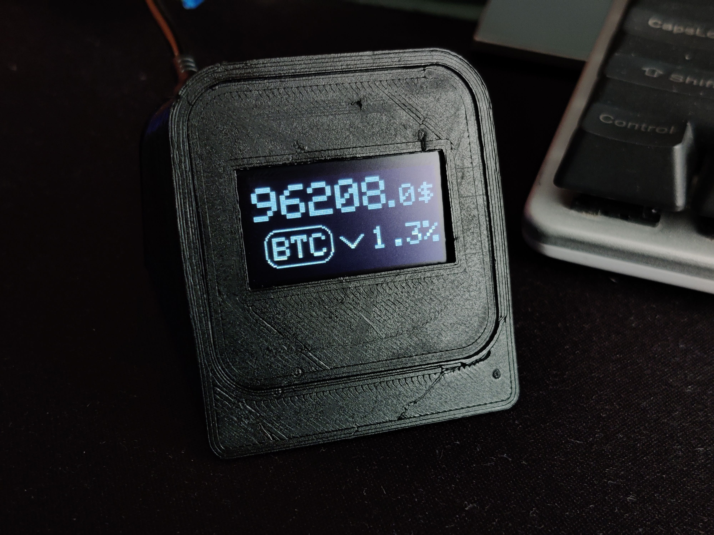
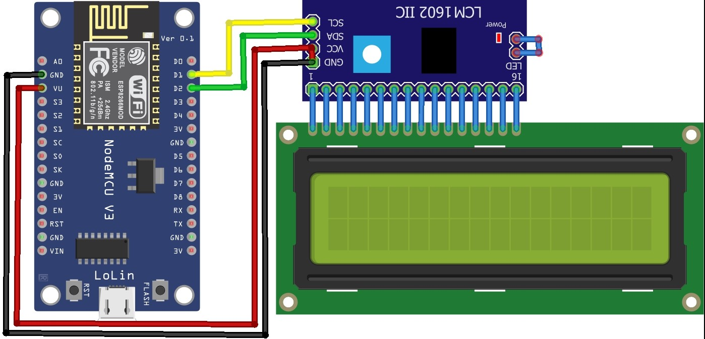

# ESP8266 Bitcoin Tracker

A real-time cryptocurrency price tracker for the ESP8266, displaying live prices and daily change indicators on an OLED display. Connects directly to the Binance API — no proxy or external server required.



## Features

- **Real-time crypto price tracking** — updates every 5 seconds
- **Direct Binance API** — no proxy, no external dependencies
- **Multi-asset support** — display and rotate between multiple cryptocurrencies (BTC, ETH, etc.)
- **Daily change indicator** — visual arrows and % change vs midnight UTC open
- **Memory-efficient** — stream-based JSON parsing, optimised for ESP8266's limited RAM
- **Low TLS overhead** — reduced BearSSL buffers (~28 KB vs default ~60 KB)

## Hardware Requirements

- **ESP8266** WiFi module (NodeMCU, Wemos D1 Mini, or compatible)
- **SH1106G OLED** 128×64 display via I2C
  - SDA → pin D1
  - SCL → pin D2
  - (configurable in `config.h`)

## Software Requirements

- Arduino IDE (1.8.13 or later)
- ESP8266 board package installed in the Arduino IDE

### Required Libraries

Install via **Sketch** → **Include Library** → **Manage Libraries**:

| Library | Author | Purpose |
|---------|--------|---------|
| `ArduinoJson` | Benoit Blanchon | Stream-based JSON parsing |
| `Adafruit GFX Library` | Adafruit | Graphics primitives |
| `Adafruit SH110X` | Adafruit | SH1106G OLED driver |

The other libraries (`ESP8266WiFi`, `ESP8266HTTPClient`, `Wire`) are included with the ESP8266 board package.

## Quick Start

### 1. Install the Board Package

In the Arduino IDE:
- **File** → **Preferences**
- Add to **Additional Board Manager URLs**:
  ```
  http://arduino.esp8266.com/stable/package_esp8266com_index.json
  ```
- **Tools** → **Board** → **Board Manager**
- Search for `esp8266` and install

### 2. Clone and Open the Project

```bash
git clone https://github.com/yourusername/esp8266-bitcoin-tracker.git
cd esp8266-bitcoin-tracker/bitcoin-tracker-oled
```

Open `bitcoin-tracker-oled.ino` in the Arduino IDE.

### 3. Configure WiFi and Symbols

Edit `config.h`:

```cpp
static const char* const ssid     = "your_ssid_here";
static const char* const password = "wifi_pass_here";

static const char* const list_of_symbols[] = {"BTC", "ETH"};  // Add your symbols
```

### 4. Flash to Your ESP8266

- Connect your ESP8266 via USB
- **Tools** → **Board** → select your board (e.g. *NodeMCU 1.0*)
- **Tools** → **Port** → select the COM port
- **Sketch** → **Upload**

### 5. Done!

The OLED will display:
- Current price with adaptive text sizing
- Symbol label in a rounded rectangle
- Daily change indicator (up/down arrow)
- Percentage change vs midnight UTC open price

Symbols rotate every 10 seconds (configurable via `SECONDS_TO_DISPLAY_EACH_SYMBOL` in `config.h`).

## Hardware Wiring

Connect the SH1106G OLED to your ESP8266 via I2C:

```
ESP8266         SH1106G OLED
─────────────────────────────
D1 (GPIO5)  ──→  SDA
D2 (GPIO4)  ──→  SCL
GND         ──→  GND
3V3         ──→  VCC
```

Refer to the connection diagram for more details:


## Configuration

All settings are in `config.h`:

| Setting | Default | Notes |
|---------|---------|-------|
| `ssid` | `"your_ssid_here"` | Your WiFi network name |
| `password` | `"wifi_pass_here"` | Your WiFi password |
| `BINANCE_HOST` | `"api.binance.com"` | Binance REST API hostname |
| `list_of_symbols` | `{"BTC", "ETH"}` | Symbols to track (any Binance base asset) |
| `SECONDS_TO_DISPLAY_EACH_SYMBOL` | `10` | Seconds to show each symbol before rotating |
| `DIFF_PRINT_PERCENTAGE_AND_VALUE` | `false` | Show % only (`false`) or % + $ change (`true`) |
| `poll_delay` | `5000` | Milliseconds between price polls |
| `TLS_READ_BUFFER` / `TLS_WRITE_BUFFER` | `1024` | TLS buffer sizes; increase to `2048` if `-5` errors occur |

## API Endpoints Used

The sketch connects directly to Binance (no proxy):

| Endpoint | Purpose | Response Size |
|----------|---------|---|
| `GET /api/v3/ticker/price?symbol={SYMBOL}USDT` | Current price | ~60 bytes |
| `GET /api/v3/klines?symbol={SYMBOL}USDT&interval=1d&limit=1` | Daily open price (midnight UTC) | ~160 bytes |

Both responses are parsed as streams (never loaded into a `String`), so the full payloads are not held in memory.

## Memory Optimization

This sketch was designed to run reliably on ESP8266 devices with limited RAM:

- **Stream-based JSON parsing** — responses parsed directly from the HTTP stream, never copied to a String
- **ArduinoJson filters** — only needed fields are allocated in the JSON document
- **Static pricing arrays** — prices stored in plain `double[]`, no JSON document overhead
- **Optimised TLS buffers** — BearSSL configured with 1024-byte buffers (~28 KB vs default ~60 KB)
- **Static storage** — configuration and symbol strings stored with `static` to avoid linker conflicts

## Troubleshooting

### WiFi won't connect
- Check `config.h` — `ssid` and `password` must match your network exactly
- Ensure the ESP8266 is within WiFi range
- Monitor the **Serial Monitor** (9600 baud) for debugging info

### Display shows garbled text
- Verify the I2C wiring (SDA/SCL to correct pins)
- Check that the display address is correct (default `0x3C`)
- If using a different display address, update `OLED_I2C_ADDR` in `config.h`

### HTTPS connection fails (error `-5`)

HTTP error code `-5` (`HTTPC_ERROR_CONNECTION_LOST`) typically indicates a TLS handshake timeout or buffer overflow. This is the most common issue on ESP8266:

**Step 1: Increase TLS buffer sizes**

The default `512` bytes is aggressive. Try `1024`:

```cpp
#define TLS_READ_BUFFER  1024
#define TLS_WRITE_BUFFER 1024
```

If that doesn't work, try `2048`:

```cpp
#define TLS_READ_BUFFER  2048
#define TLS_WRITE_BUFFER 2048
```

**Step 2: Check poll delay**

If you reduced `poll_delay` below `5000` ms, the ESP8266 may not have enough time to complete the TLS handshake. Try the default:

```cpp
const int poll_delay = 5000;   // 5 seconds
```

**Step 3: Enable debug logging**

Uncomment in `debug.h`:

```cpp
#define DEBUG
```

Then check the serial output for the full error chain. Errors like `JSON error` or `HTTP error` with a code will tell you what went wrong.

**Step 4: Verify Binance connectivity**

From your computer on the same network, test:

```bash
curl https://api.binance.com/api/v3/ping
# Should return: {}
```

If that fails, your network may be blocking Binance API. Check firewall rules.

### Prices not updating
- Check **Serial Monitor** for error messages (run with `DEBUG` enabled in `debug.h`)
- Verify Binance API is accessible from your network (try visiting `https://api.binance.com/api/v3/ping`)
- Increase `poll_delay` if requests are timing out

### Enable debug output
- In `debug.h`, uncomment the `#define DEBUG` line
- Recompile and flash
- Open **Serial Monitor** at 9600 baud to see detailed logs

## File Structure

```
bitcoin-tracker-oled/
├── bitcoin-tracker-oled.ino    ← Entry point (setup/loop)
├── config.h                    ← User configuration (edit this!)
├── debug.h                     ← Debug logging macro
├── api.h / api.cpp             ← Binance HTTPS functions
├── display_utils.h / .cpp      ← OLED rendering logic
└── icons.h                     ← Direction arrow bitmaps
```

## LCD Variant

The `bitcoin-tracker-lcd/` directory contains an older variant of this project targeting a 16×2 LCD display. **This variant is deprecated and no longer maintained.** It uses an HTTP proxy and an outdated API integration that are incompatible with the current architecture. Use `bitcoin-tracker-oled/` instead.

## License

MIT

## Contributing

Pull requests welcome! Please ensure code is well-documented with Doxygen comments.

## Disclaimer

This project is provided as-is. The author assumes no liability for any damages or losses incurred through its use. Cryptocurrency prices are provided by Binance and may be subject to delays or inaccuracies.
